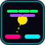

# 🏓 Laser Paddle Mayhem

> A high-speed, neon-synthwave webcam breakout & cyber-pong game with dual-hand tracking. Engineered to run at 60 FPS even on low-end Chromebooks.



---

## ⚡ Key Highlights

- 🖐️ **Dual-Hand & Single-Hand Webcam Tracking:** Control energetic laser paddles using your hands (camera feed is never displayed directly on screen; your posture is converted into glowing laser gauntlets).
- 📐 **Wrist Tilt Steering:** Angle your hands to curve shots and bank balls into tight brick formations.
- ⚡ **Gesture Abilities:**
  - **Pinch / Fist:** Triggers a *Power Smash* and fires dual laser cannons.
  - **Clap / Hand Proximity:** Unleashes an *EMP Shockwave* that damages low-row bricks and deflects falling balls.
- 🚀 **Optimized for Older Chromebooks:**
  - 320x240 offscreen downscaled vision pipeline (keeps CPU & RAM load near zero).
  - Decoupled background vision loop + 60 FPS interpolated Canvas2D render loop.
  - Object-pooled particle engine with zero garbage-collection stutter.
  - 100% procedural Web Audio API sounds & synthwave music (0 KB external audio files).
- 🕹️ **3 Game Modes:**
  - **Campaign Mode (10 Stages):** Unique sector patterns, moving hazard barriers, and the Cyber Core Boss.
  - **Endless Survival:** Infinite wave scaling, multi-ball frenzy, and high-score multiplier combos.
  - **Cyber Duel (vs AI):** 1v1 pong breakout battle against a reactive AI core.
- 🖱️ **Mouse & Touch Fallback:** Automatically switches to mouse/touch controls if camera permissions are denied or unavailable.

---

## 🛠️ Tech Stack

- **Framework:** React 19 + TypeScript + Vite
- **Hand Tracking:** MediaPipe Tasks Vision (`@mediapipe/tasks-vision` WebAssembly / WebGL)
- **Styling:** Tailwind CSS + Custom Neon Glow Design System
- **Rendering:** HTML5 High-Performance Canvas2D with 3D Synthwave Grid & Bloom Shaders
- **Audio:** Web Audio API Procedural Synthesizer & Synthwave Arpeggiator

---

## 🚀 Quick Start (Local Development)

```bash
# 1. Install dependencies
npm install

# 2. Start the Vite dev server
npm run dev
```

Open `http://localhost:5173` in your browser and allow webcam access when prompted.

---

## 🌐 Deploy to Vercel

### Option 1: Via Vercel Web Dashboard
1. Push this repository to GitHub:
   ```bash
   git init
   git add .
   git commit -m "Initial commit: Laser Paddle Mayhem"
   git branch -M main
   git remote add origin https://github.com/YOUR_USERNAME/laser-paddle-mayhem.git
   git push -u origin main
   ```
2. Go to [vercel.com](https://vercel.com) and click **"Add New Project"**.
3. Import your GitHub repository.
4. Click **Deploy** (Vite settings are pre-configured in `vercel.json`).

### Option 2: Via Vercel CLI
```bash
npx vercel
```

---

## 🎮 How to Play & Controls

| Action | Webcam Gesture | Mouse / Keyboard |
| :--- | :--- | :--- |
| **Move Left Paddle** | Move Left Hand horizontally | Cursor Position (Left Side) |
| **Move Right Paddle** | Move Right Hand horizontally | Cursor Position (Right Side) |
| **Tilt Paddle Angle** | Tilt wrist left or right | N/A |
| **Power Smash / Lasers** | Pinch thumb & index (or close fist) | Left Click |
| **EMP Shockwave** | Bring hands close together / Clap | Spacebar |

---

## 📦 Power-Up Badges

- ⚡ **Multi-Ball:** Triples all active laser balls
- 🔫 **Laser Cannons:** Mounts rapid-fire blaster cannons onto your paddles
- ☄️ **Plasma Burn:** Turns balls into fiery plasma that pierces straight through bricks
- 🛡️ **Wide Shield:** Doubles your paddle barrier width
- ⏱️ **Chrono Slow:** Enters bullet-time slow-motion for precision aiming
- ⚓ **Bottom Barrier:** Spawns an impenetrable bottom laser net
- ❤️ **Extra Life:** Restores lost core energy

---

## 📄 License
MIT License. Created with ❤️ for smooth, accessible webcam gaming!
